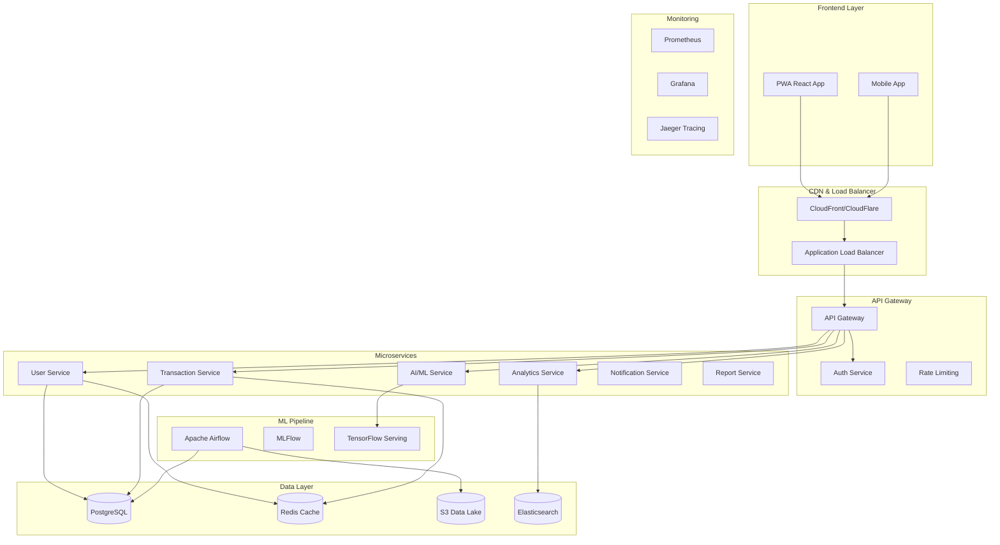

# 🚀 Finance Analytics Dashboard - SaaS Platform

## 📋 Visão Geral

Uma plataforma SaaS completa de análise financeira com IA, gamificação e arquitetura multi-tenant escalável. Transforme dados financeiros em insights acionáveis com dashboards interativos, previsões de ML e assistente de IA.

## 🏗️ Arquitetura do Sistema



## 🌐 Infraestrutura como Código

### Terraform - AWS Infrastructure

```hcl
# terraform/main.tf
provider "aws" {
  region = var.aws_region
}

# VPC Configuration
module "vpc" {
  source = "terraform-aws-modules/vpc/aws"
  
  name = "finance-analytics-vpc"
  cidr = "10.0.0.0/16"
  
  azs             = ["${var.aws_region}a", "${var.aws_region}b", "${var.aws_region}c"]
  private_subnets = ["10.0.1.0/24", "10.0.2.0/24", "10.0.3.0/24"]
  public_subnets  = ["10.0.101.0/24", "10.0.102.0/24", "10.0.103.0/24"]
  
  enable_nat_gateway = true
  enable_vpn_gateway = true
  
  tags = {
    Environment = var.environment
    Project     = "finance-analytics"
  }
}

# EKS Cluster
module "eks" {
  source = "terraform-aws-modules/eks/aws"
  
  cluster_name    = "finance-analytics-${var.environment}"
  cluster_version = "1.28"
  
  vpc_id     = module.vpc.vpc_id
  subnet_ids = module.vpc.private_subnets
  
  node_groups = {
    main = {
      desired_capacity = 3
      max_capacity     = 10
      min_capacity     = 1
      
      instance_types = ["t3.medium"]
      
      k8s_labels = {
        Environment = var.environment
        Application = "finance-analytics"
      }
    }
  }
}

# RDS PostgreSQL
resource "aws_db_instance" "main" {
  identifier = "finance-analytics-${var.environment}"
  
  engine         = "postgres"
  engine_version = "15.4"
  instance_class = "db.t3.micro"
  
  allocated_storage     = 20
  max_allocated_storage = 100
  
  db_name  = "finance_analytics"
  username = var.db_username
  password = var.db_password
  
  vpc_security_group_ids = [aws_security_group.rds.id]
  db_subnet_group_name   = aws_db_subnet_group.main.name
  
  backup_retention_period = 7
  backup_window          = "03:00-04:00"
  maintenance_window     = "sun:04:00-sun:05:00"
  
  skip_final_snapshot = var.environment != "prod"
  
  tags = {
    Environment = var.environment
  }
}

# ElastiCache Redis
resource "aws_elasticache_subnet_group" "main" {
  name       = "finance-analytics-cache-subnet"
  subnet_ids = module.vpc.private_subnets
}

resource "aws_elasticache_cluster" "main" {
  cluster_id           = "finance-analytics-${var.environment}"
  engine               = "redis"
  node_type            = "cache.t3.micro"
  num_cache_nodes      = 1
  parameter_group_name = "default.redis7"
  port                 = 6379
  subnet_group_name    = aws_elasticache_subnet_group.main.name
  security_group_ids   = [aws_security_group.redis.id]
}

# S3 Data Lake
resource "aws_s3_bucket" "data_lake" {
  bucket = "finance-analytics-data-lake-${var.environment}-${random_string.bucket_suffix.result}"
}

resource "aws_s3_bucket_versioning" "data_lake" {
  bucket = aws_s3_bucket.data_lake.id
  versioning_configuration {
    status = "Enabled"
  }
}

resource "aws_s3_bucket_server_side_encryption_configuration" "data_lake" {
  bucket = aws_s3_bucket.data_lake.id
  
  rule {
    apply_server_side_encryption_by_default {
      sse_algorithm = "AES256"
    }
  }
}

# CloudFront Distribution
resource "aws_cloudfront_distribution" "main" {
  origin {
    domain_name = aws_lb.main.dns_name
    origin_id   = "finance-analytics-origin"
    
    custom_origin_config {
      http_port              = 80
      https_port             = 443
      origin_protocol_policy = "https-only"
      origin_ssl_protocols   = ["TLSv1.2"]
    }
  }
  
  enabled             = true
  is_ipv6_enabled     = true
  default_root_object = "index.html"
  
  default_cache_behavior {
    allowed_methods        = ["DELETE", "GET", "HEAD", "OPTIONS", "PATCH", "POST", "PUT"]
    cached_methods         = ["GET", "HEAD"]
    target_origin_id       = "finance-analytics-origin"
    compress               = true
    viewer_protocol_policy = "redirect-to-https"
    
    forwarded_values {
      query_string = false
      cookies {
        forward = "none"
      }
    }
  }
  
  restrictions {
    geo_restriction {
      restriction_type = "none"
    }
  }
  
  viewer_certificate {
    cloudfront_default_certificate = true
  }
  
  tags = {
    Environment = var.environment
  }
}
```

### Kubernetes Manifests

```yaml
# k8s/namespace.yaml
apiVersion: v1
kind: Namespace
metadata:
  name: finance-analytics
  labels:
    name: finance-analytics
---
# k8s/frontend-deployment.yaml
apiVersion: apps/v1
kind: Deployment
metadata:
  name: frontend
  namespace: finance-analytics
spec:
  replicas: 3
  selector:
    matchLabels:
      app: frontend
  template:
    metadata:
      labels:
        app: frontend
    spec:
      containers:
      - name: frontend
        image: finance-analytics/frontend:latest
        ports:
        - containerPort: 3000
        env:
        - name: REACT_APP_API_URL
          value: "https://api.finance-analytics.com"
        - name: REACT_APP_ENVIRONMENT
          value: "production"
        resources:
          requests:
            memory: "256Mi"
            cpu: "250m"
          limits:
            memory: "512Mi"
            cpu: "500m"
        livenessProbe:
          httpGet:
            path: /health
            port: 3000
          initialDelaySeconds: 30
          periodSeconds: 10
        readinessProbe:
          httpGet:
            path: /ready
            port: 3000
          initialDelaySeconds: 5
          periodSeconds: 5
---
apiVersion: v1
kind: Service
metadata:
  name: frontend-service
  namespace: finance-analytics
spec:
  selector:
    app: frontend
  ports:
  - protocol: TCP
    port: 80
    targetPort: 3000
  type: ClusterIP
```

## 🎮 Sistema de Gamificação

### Badges e Conquistas

```typescript
// src/types/gamification.ts
export interface Badge {
  id: string;
  name: string;
  description: string;
  icon: string;
  rarity: 'common' | 'rare' | 'epic' | 'legendary';
  requirements: BadgeRequirement[];
  rewards: Reward[];
}

export interface BadgeRequirement {
  type: 'transaction_count' | 'budget_created' | 'savings_goal' | 'streak_days';
  value: number;
  timeframe?: 'daily' | 'weekly' | 'monthly' | 'all_time';
}

export interface Reward {
  type: 'coins' | 'feature_unlock' | 'discount';
  value: number;
  description: string;
}

export interface UserProgress {
  userId: string;
  level: number;
  experience: number;
  coins: number;
  badges: string[];
  streaks: {
    daily_login: number;
    transaction_entry: number;
    budget_adherence: number;
  };
  achievements: Achievement[];
}

export interface Achievement {
  id: string;
  badgeId: string;
  unlockedAt: Date;
  progress: number;
  completed: boolean;
}
```

### Componente de Gamificação

```tsx
// src/components/Gamification/ProgressBar.tsx
import React from 'react';
import { Progress } from '@/components/ui/progress';
import { Badge } from '@/components/ui/badge';
import { Card, CardContent, CardHeader, CardTitle } from '@/components/ui/card';
import { Trophy, Star, Coins, Target } from 'lucide-react';

interface ProgressBarProps {
  userProgress: UserProgress;
  onboardingSteps: OnboardingStep[];
}

export const GamificationProgressBar: React.FC<ProgressBarProps> = ({
  userProgress,
  onboardingSteps
}) => {
  const completedSteps = onboardingSteps.filter(step => step.completed).length;
  const totalSteps = onboardingSteps.length;
  const progressPercentage = (completedSteps / totalSteps) * 100;

  return (
    <Card className="mb-6 bg-gradient-to-r from-purple-500/10 to-blue-500/10 border-purple-200 dark:border-purple-800">
      <CardHeader>
        <CardTitle className="flex items-center space-x-2">
          <Trophy className="w-5 h-5 text-yellow-500" />
          <span>Seu Progresso</span>
        </CardTitle>
      </CardHeader>
      <CardContent className="space-y-4">
        {/* Level and Experience */}
        <div className="flex items-center justify-between">
          <div className="flex items-center space-x-2">
            <Star className="w-5 h-5 text-yellow-500" />
            <span className="font-semibold">Nível {userProgress.level}</span>
          </div>
          <div className="flex items-center space-x-2">
            <Coins className="w-5 h-5 text-yellow-500" />
            <span className="font-semibold">{userProgress.coins} moedas</span>
          </div>
        </div>

        {/* Onboarding Progress */}
        <div className="space-y-2">
          <div className="flex justify-between text-sm">
            <span>Setup da Conta</span>
            <span>{completedSteps}/{totalSteps}</span>
          </div>
          <Progress value={progressPercentage} className="h-2" />
        </div>

        {/* Recent Badges */}
        <div className="space-y-2">
          <h4 className="text-sm font-medium">Conquistas Recentes</h4>
          <div className="flex flex-wrap gap-2">
            {userProgress.badges.slice(-3).map((badgeId) => (
              <Badge key={badgeId} variant="secondary" className="text-xs">
                🏆 {badgeId}
              </Badge>
            ))}
          </div>
        </div>

        {/* Next Goals */}
        <div className="space-y-2">
          <h4 className="text-sm font-medium flex items-center">
            <Target className="w-4 h-4 mr-1" />
            Próximas Metas
          </h4>
          <div className="text-xs text-muted-foreground space-y-1">
            <div>• Adicione 5 transações (3/5)</div>
            <div>• Crie seu primeiro orçamento</div>
            <div>• Configure uma meta de economia</div>
          </div>
        </div>
      </CardContent>
    </Card>
  );
};
```

## 🤖 Sistema de IA Avançado

### Serviço de IA com Gemini

```typescript
// src/services/ai/geminiService.ts
import { GoogleGenerativeAI } from '@google/generative-ai';

export class GeminiAIService {
  private genAI: GoogleGenerativeAI;
  private model: any;

  constructor(apiKey: string) {
    this.genAI = new GoogleGenerativeAI(apiKey);
    this.model = this.genAI.getGenerativeModel({ model: 'gemini-pro' });
  }

  async generateFinancialInsights(
    transactions: Transaction[],
    userContext: UserContext
  ): Promise<FinancialInsight[]> {
    const prompt = this.buildInsightPrompt(transactions, userContext);
    
    try {
      const result = await this.model.generateContent(prompt);
      const response = await result.response;
      const insights = this.parseInsights(response.text());
      
      return insights;
    } catch (error) {
      console.error('Error generating insights:', error);
      throw new Error('Failed to generate financial insights');
    }
  }

  async generateBudgetRecommendations(
    historicalData: HistoricalData,
    userGoals: UserGoals
  ): Promise<BudgetRecommendation[]> {
    const prompt = `
      Baseado nos dados históricos financeiros do usuário:
      - Receita média mensal: R$ ${historicalData.averageIncome}
      - Gastos por categoria: ${JSON.stringify(historicalData.categorySpending)}
      - Metas financeiras: ${JSON.stringify(userGoals)}
      
      Gere recomendações de orçamento inteligentes que:
      1. Sejam realistas baseadas no histórico
      2. Ajudem a alcançar as metas definidas
      3. Incluam margem para emergências
      4. Considerem sazonalidade nos gastos
      
      Retorne em formato JSON com categorias e valores sugeridos.
    `;

    const result = await this.model.generateContent(prompt);
    const response = await result.response;
    
    return this.parseBudgetRecommendations(response.text());
  }

  async detectAnomalies(
    transactions: Transaction[],
    userProfile: UserProfile
  ): Promise<Anomaly[]> {
    const prompt = `
      Analise as seguintes transações para detectar anomalias:
      ${JSON.stringify(transactions)}
      
      Perfil do usuário:
      - Padrão de gastos habitual: ${JSON.stringify(userProfile.spendingPatterns)}
      - Renda mensal: R$ ${userProfile.monthlyIncome}
      
      Identifique:
      1. Gastos incomuns (valor ou categoria)
      2. Padrões suspeitos
      3. Oportunidades de economia
      4. Alertas de orçamento
      
      Retorne em formato JSON com tipo, severidade e descrição.
    `;

    const result = await this.model.generateContent(prompt);
    const response = await result.response;
    
    return this.parseAnomalies(response.text());
  }

  private buildInsightPrompt(transactions: Transaction[], context: UserContext): string {
    return `
      Como especialista em finanças pessoais, analise os dados abaixo e gere insights acionáveis:
      
      Transações recentes:
      ${JSON.stringify(transactions.slice(-50))}
      
      Contexto do usuário:
      - Idade: ${context.age}
      - Renda mensal: R$ ${context.monthlyIncome}
      - Objetivos: ${context.goals.join(', ')}
      
      Gere 3-5 insights específicos sobre:
      1. Padrões de gastos
      2. Oportunidades de economia
      3. Tendências preocupantes
      4. Recomendações personalizadas
      
      Seja específico, use números e dê dicas práticas.
    `;
  }

  private parseInsights(text: string): FinancialInsight[] {
    // Parse the AI response and structure it
    // Implementation would depend on the response format
    return [];
  }

  private parseBudgetRecommendations(text: string): BudgetRecommendation[] {
    // Parse budget recommendations from AI response
    return [];
  }

  private parseAnomalies(text: string): Anomaly[] {
    // Parse anomaly detection results
    return [];
  }
}
```

### Chatbot Inteligente com Embeddings

```typescript
// src/services/ai/chatbotService.ts
import { OpenAI } from 'openai';
import { PineconeClient } from '@pinecone-database/pinecone';

export class IntelligentChatbot {
  private openai: OpenAI;
  private pinecone: PineconeClient;
  private index: any;

  constructor(openaiKey: string, pineconeKey: string) {
    this.openai = new OpenAI({ apiKey: openaiKey });
    this.pinecone = new PineconeClient();
    this.initializePinecone(pineconeKey);
  }

  async initializePinecone(apiKey: string) {
    await this.pinecone.init({
      apiKey,
      environment: 'us-west1-gcp'
    });
    this.index = this.pinecone.Index('financial-knowledge');
  }

  async processUserQuery(
    query: string,
    userContext: UserFinancialContext
  ): Promise<ChatResponse> {
    // 1. Generate embeddings for the query
    const queryEmbedding = await this.generateEmbedding(query);
    
    // 2. Search for relevant financial knowledge
    const relevantContext = await this.searchKnowledgeBase(queryEmbedding);
    
    // 3. Build context-aware prompt
    const prompt = this.buildContextualPrompt(query, userContext, relevantContext);
    
    // 4. Generate response using GPT
    const response = await this.openai.chat.completions.create({
      model: 'gpt-4',
      messages: [
        {
          role: 'system',
          content: `Você é um assistente financeiro especializado. Use os dados do usuário e conhecimento financeiro para dar respostas precisas e personalizadas.`
        },
        {
          role: 'user',
          content: prompt
        }
      ],
      temperature: 0.7,
      max_tokens: 500
    });

    return {
      message: response.choices[0].message?.content || '',
      suggestions: this.generateSuggestions(query, userContext),
      actions: this.generateActionItems(query, userContext)
    };
  }

  private async generateEmbedding(text: string): Promise<number[]> {
    const response = await this.openai.embeddings.create({
      model: 'text-embedding-ada-002',
      input: text
    });
    
    return response.data[0].embedding;
  }

  private async searchKnowledgeBase(embedding: number[]): Promise<string[]> {
    const searchResponse = await this.index.query({
      queryRequest: {
        vector: embedding,
        topK: 5,
        includeMetadata: true
      }
    });

    return searchResponse.matches?.map(match => match.metadata?.text) || [];
  }

  private buildContextualPrompt(
    query: string,
    userContext: UserFinancialContext,
    relevantContext: string[]
  ): string {
    return `
      Pergunta do usuário: ${query}
      
      Contexto financeiro do usuário:
      - Saldo atual: R$ ${userContext.currentBalance}
      - Receita mensal: R$ ${userContext.monthlyIncome}
      - Principais categorias de gasto: ${userContext.topCategories.join(', ')}
      - Metas financeiras: ${userContext.goals.join(', ')}
      
      Conhecimento relevante:
      ${relevantContext.join('\n\n')}
      
      Responda de forma personalizada, específica e acionável.
    `;
  }

  private generateSuggestions(query: string, context: UserFinancialContext): string[] {
    // Generate contextual suggestions based on the query and user data
    return [
      'Ver relatório detalhado de gastos',
      'Criar orçamento para próximo mês',
      'Analisar tendências de economia'
    ];
  }

  private generateActionItems(query: string, context: UserFinancialContext): ActionItem[] {
    // Generate actionable items based on the conversation
    return [
      {
        type: 'create_budget',
        title: 'Criar orçamento mensal',
        description: 'Configure limites de gastos por categoria'
      }
    ];
  }
}
```

## 📊 Dashboard Analítico Avançado

### Componentes de Visualização

```tsx
// src/components/Analytics/AdvancedDashboard.tsx
import React, { useState, useEffect } from 'react';
import {
  LineChart, Line, AreaChart, Area, BarChart, Bar,
  PieChart, Pie, Cell, ResponsiveContainer,
  XAxis, YAxis, CartesianGrid, Tooltip, Legend
} from 'recharts';
import { Card, CardContent, CardHeader, CardTitle } from '@/components/ui/card';
import { Tabs, TabsContent, TabsList, TabsTrigger } from '@/components/ui/tabs';
import { Select, SelectContent, SelectItem, SelectTrigger, SelectValue } from '@/components/ui/select';

export const AdvancedDashboard: React.FC = () => {
  const [timeRange, setTimeRange] = useState('6months');
  const [selectedMetrics, setSelectedMetrics] = useState(['revenue', 'expenses', 'profit']);

  return (
    <div className="space-y-6">
      {/* KPI Cards */}
      <div className="grid grid-cols-1 md:grid-cols-2 lg:grid-cols-4 gap-4">
        <KPICard
          title="Burn Rate"
          value="R$ 3.200"
          change="-5.2%"
          trend="down"
          description="Taxa de queima mensal"
        />
        <KPICard
          title="Runway"
          value="18 meses"
          change="+2 meses"
          trend="up"
          description="Tempo até acabar o dinheiro"
        />
        <KPICard
          title="Savings Rate"
          value="23%"
          change="+3.1%"
          trend="up"
          description="Taxa de poupança"
        />
        <KPICard
          title="ROI Investimentos"
          value="12.5%"
          change="+1.8%"
          trend="up"
          description="Retorno sobre investimentos"
        />
      </div>

      {/* Time Series Forecasting */}
      <Card>
        <CardHeader>
          <CardTitle>Previsão de Fluxo de Caixa</CardTitle>
          <Select value={timeRange} onValueChange={setTimeRange}>
            <SelectTrigger className="w-48">
              <SelectValue />
            </SelectTrigger>
            <SelectContent>
              <SelectItem value="3months">Últimos 3 meses</SelectItem>
              <SelectItem value="6months">Últimos 6 meses</SelectItem>
              <SelectItem value="1year">Último ano</SelectItem>
            </SelectContent>
          </Select>
        </CardHeader>
        <CardContent>
          <ResponsiveContainer width="100%" height={400}>
            <LineChart data={forecastData}>
              <CartesianGrid strokeDasharray="3 3" />
              <XAxis dataKey="month" />
              <YAxis />
              <Tooltip formatter={(value) => `R$ ${value.toLocaleString()}`} />
              <Legend />
              <Line 
                type="monotone" 
                dataKey="actual" 
                stroke="#8884d8" 
                strokeWidth={2}
                name="Real"
              />
              <Line 
                type="monotone" 
                dataKey="predicted" 
                stroke="#82ca9d" 
                strokeDasharray="5 5"
                strokeWidth={2}
                name="Previsto"
              />
              <Area
                type="monotone"
                dataKey="confidence"
                stroke="#ffc658"
                fill="#ffc658"
                fillOpacity={0.2}
                name="Intervalo de Confiança"
              />
            </LineChart>
          </ResponsiveContainer>
        </CardContent>
      </Card>

      {/* Heatmap de Gastos */}
      <Card>
        <CardHeader>
          <CardTitle>Heatmap de Gastos por Hora e Dia</CardTitle>
        </CardHeader>
        <CardContent>
          <SpendingHeatmap data={heatmapData} />
        </CardContent>
      </Card>

      {/* Sankey Chart para Fluxos */}
      <Card>
        <CardHeader>
          <CardTitle>Fluxo de Caixa entre Categorias</CardTitle>
        </CardHeader>
        <CardContent>
          <SankeyChart data={sankeyData} />
        </CardContent>
      </Card>

      {/* Análise de Anomalias */}
      <Card>
        <CardHeader>
          <CardTitle>Detecção de Anomalias</CardTitle>
        </CardHeader>
        <CardContent>
          <AnomalyDetectionChart data={anomalyData} />
        </CardContent>
      </Card>
    </div>
  );
};

const KPICard: React.FC<KPICardProps> = ({ title, value, change, trend, description }) => (
  <Card>
    <CardHeader className="pb-2">
      <CardTitle className="text-sm font-medium text-muted-foreground">
        {title}
      </CardTitle>
    </CardHeader>
    <CardContent>
      <div className="text-2xl font-bold">{value}</div>
      <div className={`text-xs flex items-center ${
        trend === 'up' ? 'text-green-600' : 'text-red-600'
      }`}>
        {trend === 'up' ? '↗' : '↘'} {change}
      </div>
      <p className="text-xs text-muted-foreground mt-1">{description}</p>
    </CardContent>
  </Card>
);
```

## 🔄 Pipeline de ETL e Data Lake

### Apache Airflow DAGs

```python
# airflow/dags/financial_data_pipeline.py
from datetime import datetime, timedelta
from airflow import DAG
from airflow.operators.python_operator import PythonOperator
from airflow.providers.postgres.operators.postgres import PostgresOperator
from airflow.providers.amazon.aws.operators.s3 import S3CreateObjectOperator

default_args = {
    'owner': 'finance-analytics',
    'depends_on_past': False,
    'start_date': datetime(2024, 1, 1),
    'email_on_failure': True,
    'email_on_retry': False,
    'retries': 1,
    'retry_delay': timedelta(minutes=5)
}

dag = DAG(
    'financial_data_etl',
    default_args=default_args,
    description='ETL pipeline for financial data',
    schedule_interval='@daily',
    catchup=False
)

def extract_bank_data(**context):
    """Extract data from bank APIs and CSV uploads"""
    from src.etl.extractors import BankDataExtractor
    
    extractor = BankDataExtractor()
    raw_data = extractor.extract_daily_transactions()
    
    # Store raw data in S3
    s3_key = f"raw/bank_data/{context['ds']}/transactions.json"
    extractor.upload_to_s3(raw_data, s3_key)
    
    return s3_key

def transform_financial_data(**context):
    """Transform and clean financial data"""
    from src.etl.transformers import FinancialDataTransformer
    
    transformer = FinancialDataTransformer()
    s3_key = context['task_instance'].xcom_pull(task_ids='extract_bank_data')
    
    # Download, transform, and upload cleaned data
    raw_data = transformer.download_from_s3(s3_key)
    cleaned_data = transformer.clean_and_normalize(raw_data)
    
    transformed_key = f"transformed/financial_data/{context['ds']}/clean_transactions.parquet"
    transformer.upload_to_s3(cleaned_data, transformed_key)
    
    return transformed_key

def load_to_warehouse(**context):
    """Load transformed data to data warehouse"""
    from src.etl.loaders import DataWarehouseLoader
    
    loader = DataWarehouseLoader()
    s3_key = context['task_instance'].xcom_pull(task_ids='transform_financial_data')
    
    # Load to PostgreSQL and Elasticsearch
    loader.load_to_postgres(s3_key)
    loader.load_to_elasticsearch(s3_key)

def generate_ml_features(**context):
    """Generate features for ML models"""
    from src.ml.feature_engineering import FeatureGenerator
    
    generator = FeatureGenerator()
    features = generator.generate_daily_features(context['ds'])
    
    # Store features for ML training
    feature_key = f"features/daily/{context['ds']}/ml_features.parquet"
    generator.upload_to_s3(features, feature_key)

# Define tasks
extract_task = PythonOperator(
    task_id='extract_bank_data',
    python_callable=extract_bank_data,
    dag=dag
)

transform_task = PythonOperator(
    task_id='transform_financial_data',
    python_callable=transform_financial_data,
    dag=dag
)

load_task = PythonOperator(
    task_id='load_to_warehouse',
    python_callable=load_to_warehouse,
    dag=dag
)

ml_features_task = PythonOperator(
    task_id='generate_ml_features',
    python_callable=generate_ml_features,
    dag=dag
)

# Set dependencies
extract_task >> transform_task >> load_task >> ml_features_task
```

## 🔐 Autenticação Multi-Tenant

### Middleware de Multi-Tenancy

```typescript
// src/middleware/multiTenant.ts
import { Request, Response, NextFunction } from 'express';
import { TenantService } from '../services/tenantService';

export interface TenantRequest extends Request {
  tenant?: Tenant;
  user?: User & { tenantId: string };
}

export const multiTenantMiddleware = async (
  req: TenantRequest,
  res: Response,
  next: NextFunction
) => {
  try {
    // Extract tenant from subdomain or header
    const tenantIdentifier = extractTenantIdentifier(req);
    
    if (!tenantIdentifier) {
      return res.status(400).json({ error: 'Tenant identifier required' });
    }

    // Load tenant configuration
    const tenantService = new TenantService();
    const tenant = await tenantService.getTenant(tenantIdentifier);
    
    if (!tenant || !tenant.active) {
      return res.status(404).json({ error: 'Tenant not found or inactive' });
    }

    // Set tenant context
    req.tenant = tenant;
    
    // Configure database connection for this tenant
    await configureTenantDatabase(tenant);
    
    next();
  } catch (error) {
    console.error('Multi-tenant middleware error:', error);
    res.status(500).json({ error: 'Internal server error' });
  }
};

function extractTenantIdentifier(req: Request): string | null {
  // Try subdomain first
  const host = req.get('host');
  if (host) {
    const subdomain = host.split('.')[0];
    if (subdomain && subdomain !== 'www' && subdomain !== 'api') {
      return subdomain;
    }
  }
  
  // Try header
  const tenantHeader = req.get('X-Tenant-ID');
  if (tenantHeader) {
    return tenantHeader;
  }
  
  // Try query parameter
  return req.query.tenant as string || null;
}

async function configureTenantDatabase(tenant: Tenant): Promise<void> {
  // Configure database schema or connection based on tenant
  const dbConfig = {
    ...defaultDbConfig,
    schema: `tenant_${tenant.id}`,
    database: tenant.isolationLevel === 'database' 
      ? `finance_analytics_${tenant.id}` 
      : 'finance_analytics'
  };
  
  // Set up tenant-specific database connection
  await DatabaseManager.configureTenant(tenant.id, dbConfig);
}
```

## 📱 PWA e Mobile-First

### Service Worker para Cache Offline

```typescript
// public/sw.js
const CACHE_NAME = 'finance-analytics-v1';
const urlsToCache = [
  '/',
  '/static/js/bundle.js',
  '/static/css/main.css',
  '/manifest.json'
];

self.addEventListener('install', (event) => {
  event.waitUntil(
    caches.open(CACHE_NAME)
      .then((cache) => cache.addAll(urlsToCache))
  );
});

self.addEventListener('fetch', (event) => {
  event.respondWith(
    caches.match(event.request)
      .then((response) => {
        // Return cached version or fetch from network
        return response || fetch(event.request);
      })
  );
});

// Background sync for offline transactions
self.addEventListener('sync', (event) => {
  if (event.tag === 'background-sync-transactions') {
    event.waitUntil(syncTransactions());
  }
});

async function syncTransactions() {
  const transactions = await getOfflineTransactions();
  
  for (const transaction of transactions) {
    try {
      await fetch('/api/transactions', {
        method: 'POST',
        body: JSON.stringify(transaction),
        headers: {
          'Content-Type': 'application/json'
        }
      });
      
      // Remove from offline storage after successful sync
      await removeOfflineTransaction(transaction.id);
    } catch (error) {
      console.error('Failed to sync transaction:', error);
    }
  }
}
```

### Manifest PWA

```json
{
  "name": "Finance Analytics Dashboard",
  "short_name": "FinanceApp",
  "description": "Análise financeira inteligente com IA",
  "start_url": "/",
  "display": "standalone",
  "background_color": "#1a1a1a",
  "theme_color": "#3b82f6",
  "orientation": "portrait-primary",
  "icons": [
    {
      "src": "/icons/icon-72x72.png",
      "sizes": "72x72",
      "type": "image/png"
    },
    {
      "src": "/icons/icon-96x96.png",
      "sizes": "96x96",
      "type": "image/png"
    },
    {
      "src": "/icons/icon-128x128.png",
      "sizes": "128x128",
      "type": "image/png"
    },
    {
      "src": "/icons/icon-144x144.png",
      "sizes": "144x144",
      "type": "image/png"
    },
    {
      "src": "/icons/icon-152x152.png",
      "sizes": "152x152",
      "type": "image/png"
    },
    {
      "src": "/icons/icon-192x192.png",
      "sizes": "192x192",
      "type": "image/png"
    },
    {
      "src": "/icons/icon-384x384.png",
      "sizes": "384x384",
      "type": "image/png"
    },
    {
      "src": "/icons/icon-512x512.png",
      "sizes": "512x512",
      "type": "image/png"
    }
  ],
  "categories": ["finance", "productivity", "business"],
  "screenshots": [
    {
      "src": "/screenshots/dashboard.png",
      "sizes": "1280x720",
      "type": "image/png"
    }
  ]
}
```

## 🚀 Deploy e CI/CD

### GitHub Actions Workflow

```yaml
# .github/workflows/deploy.yml
name: Deploy Finance Analytics

on:
  push:
    branches: [main, develop]
  pull_request:
    branches: [main]

env:
  AWS_REGION: us-east-1
  EKS_CLUSTER_NAME: finance-analytics-prod

jobs:
  test:
    runs-on: ubuntu-latest
    steps:
    - uses: actions/checkout@v3
    
    - name: Setup Node.js
      uses: actions/setup-node@v3
      with:
        node-version: '18'
        cache: 'npm'
    
    - name: Install dependencies
      run: npm ci
    
    - name: Run linting
      run: npm run lint
    
    - name: Run unit tests
      run: npm run test:unit
    
    - name: Run integration tests
      run: npm run test:integration
    
    - name: Run E2E tests
      run: npm run test:e2e
    
    - name: Check test coverage
      run: npm run test:coverage
    
    - name: Upload coverage to Codecov
      uses: codecov/codecov-action@v3

  security:
    runs-on: ubuntu-latest
    steps:
    - uses: actions/checkout@v3
    
    - name: Run security audit
      run: npm audit --audit-level high
    
    - name: Run SAST scan
      uses: github/super-linter@v4
      env:
        DEFAULT_BRANCH: main
        GITHUB_TOKEN: ${{ secrets.GITHUB_TOKEN }}

  build:
    needs: [test, security]
    runs-on: ubuntu-latest
    if: github.ref == 'refs/heads/main'
    
    steps:
    - uses: actions/checkout@v3
    
    - name: Configure AWS credentials
      uses: aws-actions/configure-aws-credentials@v2
      with:
        aws-access-key-id: ${{ secrets.AWS_ACCESS_KEY_ID }}
        aws-secret-access-key: ${{ secrets.AWS_SECRET_ACCESS_KEY }}
        aws-region: ${{ env.AWS_REGION }}
    
    - name: Login to Amazon ECR
      id: login-ecr
      uses: aws-actions/amazon-ecr-login@v1
    
    - name: Build and push Docker image
      env:
        ECR_REGISTRY: ${{ steps.login-ecr.outputs.registry }}
        ECR_REPOSITORY: finance-analytics
        IMAGE_TAG: ${{ github.sha }}
      run: |
        docker build -t $ECR_REGISTRY/$ECR_REPOSITORY:$IMAGE_TAG .
        docker push $ECR_REGISTRY/$ECR_REPOSITORY:$IMAGE_TAG
        docker tag $ECR_REGISTRY/$ECR_REPOSITORY:$IMAGE_TAG $ECR_REGISTRY/$ECR_REPOSITORY:latest
        docker push $ECR_REGISTRY/$ECR_REPOSITORY:latest

  deploy:
    needs: build
    runs-on: ubuntu-latest
    if: github.ref == 'refs/heads/main'
    
    steps:
    - uses: actions/checkout@v3
    
    - name: Configure AWS credentials
      uses: aws-actions/configure-aws-credentials@v2
      with:
        aws-access-key-id: ${{ secrets.AWS_ACCESS_KEY_ID }}
        aws-secret-access-key: ${{ secrets.AWS_SECRET_ACCESS_KEY }}
        aws-region: ${{ env.AWS_REGION }}
    
    - name: Update kubeconfig
      run: |
        aws eks update-kubeconfig --region ${{ env.AWS_REGION }} --name ${{ env.EKS_CLUSTER_NAME }}
    
    - name: Deploy to Kubernetes
      run: |
        kubectl set image deployment/frontend frontend=${{ steps.login-ecr.outputs.registry }}/finance-analytics:${{ github.sha }} -n finance-analytics
        kubectl rollout status deployment/frontend -n finance-analytics
    
    - name: Run smoke tests
      run: |
        kubectl run smoke-test --image=curlimages/curl --rm -i --restart=Never -- curl -f http://frontend-service/health

  performance:
    needs: deploy
    runs-on: ubuntu-latest
    if: github.ref == 'refs/heads/main'
    
    steps:
    - uses: actions/checkout@v3
    
    - name: Run load tests
      run: |
        docker run --rm -v $(pwd)/k6:/scripts grafana/k6 run /scripts/load-test.js
```

## 📊 Monitoramento e Observabilidade

### Prometheus Configuration

```yaml
# monitoring/prometheus.yml
global:
  scrape_interval: 15s
  evaluation_interval: 15s

rule_files:
  - "alert_rules.yml"

scrape_configs:
  - job_name: 'finance-analytics-frontend'
    static_configs:
      - targets: ['frontend-service:3000']
    metrics_path: '/metrics'
    scrape_interval: 30s

  - job_name: 'finance-analytics-api'
    static_configs:
      - targets: ['api-service:8080']
    metrics_path: '/metrics'
    scrape_interval: 15s

  - job_name: 'postgres-exporter'
    static_configs:
      - targets: ['postgres-exporter:9187']

  - job_name: 'redis-exporter'
    static_configs:
      - targets: ['redis-exporter:9121']

alerting:
  alertmanagers:
    - static_configs:
        - targets:
          - alertmanager:9093
```

### Grafana Dashboard

```json
{
  "dashboard": {
    "title": "Finance Analytics - Application Metrics",
    "panels": [
      {
        "title": "Request Rate",
        "type": "graph",
        "targets": [
          {
            "expr": "rate(http_requests_total[5m])",
            "legendFormat": "{{method}} {{status}}"
          }
        ]
      },
      {
        "title": "Response Time",
        "type": "graph",
        "targets": [
          {
            "expr": "histogram_quantile(0.95, rate(http_request_duration_seconds_bucket[5m]))",
            "legendFormat": "95th percentile"
          }
        ]
      },
      {
        "title": "Error Rate",
        "type": "singlestat",
        "targets": [
          {
            "expr": "rate(http_requests_total{status=~\"5..\"}[5m]) / rate(http_requests_total[5m])",
            "legendFormat": "Error Rate"
          }
        ]
      },
      {
        "title": "Active Users",
        "type": "graph",
        "targets": [
          {
            "expr": "active_users_total",
            "legendFormat": "Active Users"
          }
        ]
      }
    ]
  }
}
```

## 🎯 Próximos Passos

1. **Implementar autenticação OAuth2 completa**
2. **Configurar pipeline de ML para previsões**
3. **Integrar APIs de Open Banking**
4. **Desenvolver marketplace de plugins**
5. **Implementar compliance LGPD/GDPR**
6. **Criar testes de carga automatizados**
7. **Configurar disaster recovery**
8. **Implementar feature flags**

Este é um esqueleto completo e escalável para um SaaS de análise financeira moderno. Cada componente pode ser expandido conforme necessário!