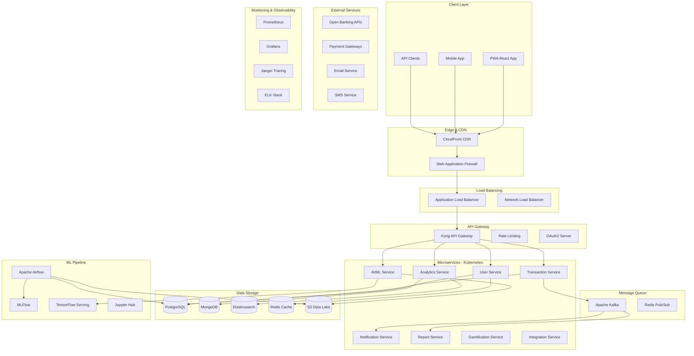

# 🏗️ Arquitetura do Sistema - Finance Analytics Dashboard

## Visão Geral da Arquitetura

O Finance Analytics Dashboard é construído seguindo uma arquitetura de microserviços moderna, escalável e orientada a eventos, projetada para suportar milhares de usuários simultâneos com alta disponibilidade.

## Diagrama de Arquitetura de Alto Nível



## Componentes Principais

### 1. Frontend Layer

#### PWA (Progressive Web App)
- **Framework**: React 18 com TypeScript
- **State Management**: Zustand + React Query
- **UI Library**: Tailwind CSS + shadcn/ui
- **Build Tool**: Vite
- **Features**:
  - Offline-first com Service Workers
  - Push notifications
  - Installable como app nativo
  - Responsive design mobile-first

#### Mobile App
- **Framework**: React Native ou Flutter
- **Shared Logic**: Compartilha hooks e services com PWA
- **Native Features**: Biometria, câmera para OCR, notificações push

### 2. API Gateway & Security

#### Kong API Gateway
```yaml
services:
  - name: user-service
    url: http://user-service:8080
    routes:
      - name: user-routes
        paths: ["/api/users"]
        methods: ["GET", "POST", "PUT", "DELETE"]
        plugins:
          - name: rate-limiting
            config:
              minute: 100
              hour: 1000
          - name: oauth2
          - name: cors
```

#### Autenticação OAuth2
- **Provider**: Keycloak ou Auth0
- **Flows**: Authorization Code + PKCE
- **Multi-tenant**: Isolamento por workspace
- **2FA**: TOTP + SMS backup

### 3. Microserviços

#### User Service
```typescript
// Responsabilidades:
// - Gestão de usuários e perfis
// - Autenticação e autorização
// - Configurações de conta
// - Multi-tenancy

interface UserService {
  createUser(userData: CreateUserRequest): Promise<User>;
  updateProfile(userId: string, profile: ProfileUpdate): Promise<User>;
  getUsersByTenant(tenantId: string): Promise<User[]>;
  deleteUser(userId: string): Promise<void>;
}
```

#### Transaction Service
```typescript
// Responsabilidades:
// - CRUD de transações
// - Categorização automática
// - Validação e normalização
// - Event sourcing

interface TransactionService {
  createTransaction(transaction: CreateTransactionRequest): Promise<Transaction>;
  getTransactions(filters: TransactionFilters): Promise<Transaction[]>;
  categorizeTransaction(transaction: Transaction): Promise<Category>;
  bulkImport(file: File): Promise<ImportResult>;
}
```

#### Analytics Service
```typescript
// Responsabilidades:
// - Agregações e métricas
// - Dashboards dinâmicos
// - Relatórios customizados
// - Real-time analytics

interface AnalyticsService {
  generateDashboard(userId: string, config: DashboardConfig): Promise<Dashboard>;
  getMetrics(filters: MetricFilters): Promise<Metrics>;
  createReport(reportConfig: ReportConfig): Promise<Report>;
  getInsights(userId: string): Promise<Insight[]>;
}
```

#### AI/ML Service
```typescript
// Responsabilidades:
// - Previsões financeiras
// - Detecção de anomalias
// - Chatbot inteligente
// - Recomendações personalizadas

interface AIService {
  predictCashFlow(userId: string, horizon: number): Promise<Prediction>;
  detectAnomalies(transactions: Transaction[]): Promise<Anomaly[]>;
  chatWithAI(message: string, context: UserContext): Promise<ChatResponse>;
  getRecommendations(userId: string): Promise<Recommendation[]>;
}
```

### 4. Data Architecture

#### PostgreSQL - Transactional Data
```sql
-- Schema multi-tenant
CREATE SCHEMA tenant_123;

-- Tabelas principais
CREATE TABLE tenant_123.users (
  id UUID PRIMARY KEY,
  email VARCHAR(255) UNIQUE NOT NULL,
  created_at TIMESTAMP DEFAULT NOW()
);

CREATE TABLE tenant_123.transactions (
  id UUID PRIMARY KEY,
  user_id UUID REFERENCES tenant_123.users(id),
  amount DECIMAL(12,2) NOT NULL,
  category_id UUID,
  created_at TIMESTAMP DEFAULT NOW()
);
```

#### Elasticsearch - Analytics & Search
```json
{
  "mappings": {
    "properties": {
      "user_id": { "type": "keyword" },
      "amount": { "type": "double" },
      "category": { "type": "keyword" },
      "timestamp": { "type": "date" },
      "description": { 
        "type": "text",
        "analyzer": "portuguese"
      }
    }
  }
}
```

#### S3 Data Lake Structure
```
s3://finance-analytics-data-lake/
├── raw/
│   ├── bank_statements/
│   ├── csv_uploads/
│   └── api_responses/
├── processed/
│   ├── daily_aggregations/
│   ├── user_profiles/
│   └── ml_features/
└── models/
    ├── forecasting/
    ├── anomaly_detection/
    └── recommendation/
```

### 5. ML Pipeline

#### Feature Engineering
```python
# airflow/dags/feature_engineering.py
def generate_user_features(user_id: str, date: str):
    """Gera features para modelos de ML"""
    features = {
        'avg_monthly_income': calculate_avg_income(user_id),
        'spending_volatility': calculate_volatility(user_id),
        'category_diversity': calculate_diversity(user_id),
        'seasonal_patterns': extract_seasonal_patterns(user_id),
        'transaction_frequency': calculate_frequency(user_id)
    }
    return features
```

#### Model Training
```python
# ml/models/cash_flow_predictor.py
import tensorflow as tf
from tensorflow.keras.models import Sequential
from tensorflow.keras.layers import LSTM, Dense, Dropout

class CashFlowPredictor:
    def __init__(self):
        self.model = self.build_model()
    
    def build_model(self):
        model = Sequential([
            LSTM(50, return_sequences=True, input_shape=(30, 10)),
            Dropout(0.2),
            LSTM(50, return_sequences=False),
            Dropout(0.2),
            Dense(25),
            Dense(1)
        ])
        
        model.compile(
            optimizer='adam',
            loss='mean_squared_error',
            metrics=['mae']
        )
        
        return model
    
    def predict(self, features):
        return self.model.predict(features)
```

### 6. Event-Driven Architecture

#### Event Schema
```typescript
interface DomainEvent {
  id: string;
  type: string;
  aggregateId: string;
  aggregateType: string;
  version: number;
  timestamp: Date;
  data: any;
  metadata: {
    userId: string;
    tenantId: string;
    correlationId: string;
  };
}

// Exemplos de eventos
interface TransactionCreated extends DomainEvent {
  type: 'TransactionCreated';
  data: {
    transactionId: string;
    amount: number;
    category: string;
    description: string;
  };
}

interface BudgetExceeded extends DomainEvent {
  type: 'BudgetExceeded';
  data: {
    budgetId: string;
    categoryId: string;
    currentAmount: number;
    budgetLimit: number;
    percentage: number;
  };
}
```

#### Event Handlers
```typescript
// Event handlers para diferentes serviços
@EventHandler('TransactionCreated')
export class TransactionCreatedHandler {
  async handle(event: TransactionCreated) {
    // Atualizar analytics em tempo real
    await this.analyticsService.updateMetrics(event.data);
    
    // Verificar orçamentos
    await this.budgetService.checkBudgetLimits(event.data);
    
    // Detectar anomalias
    await this.aiService.analyzeTransaction(event.data);
  }
}
```

### 7. Caching Strategy

#### Multi-Level Caching
```typescript
// Cache hierarchy
class CacheManager {
  private l1Cache: Map<string, any> = new Map(); // In-memory
  private l2Cache: Redis; // Redis
  private l3Cache: S3; // S3 for large objects
  
  async get(key: string): Promise<any> {
    // L1 - Memory cache
    if (this.l1Cache.has(key)) {
      return this.l1Cache.get(key);
    }
    
    // L2 - Redis cache
    const redisValue = await this.l2Cache.get(key);
    if (redisValue) {
      this.l1Cache.set(key, redisValue);
      return redisValue;
    }
    
    // L3 - S3 cache (for large datasets)
    const s3Value = await this.l3Cache.getObject(key);
    if (s3Value) {
      await this.l2Cache.set(key, s3Value, 'EX', 3600);
      this.l1Cache.set(key, s3Value);
      return s3Value;
    }
    
    return null;
  }
}
```

### 8. Security Architecture

#### Zero Trust Security Model
```typescript
// Security middleware stack
const securityMiddleware = [
  rateLimiting({
    windowMs: 15 * 60 * 1000, // 15 minutes
    max: 100 // limit each IP to 100 requests per windowMs
  }),
  
  helmet({
    contentSecurityPolicy: {
      directives: {
        defaultSrc: ["'self'"],
        styleSrc: ["'self'", "'unsafe-inline'"],
        scriptSrc: ["'self'"],
        imgSrc: ["'self'", "data:", "https:"]
      }
    }
  }),
  
  cors({
    origin: process.env.ALLOWED_ORIGINS?.split(','),
    credentials: true
  }),
  
  jwtAuth({
    secret: process.env.JWT_SECRET,
    algorithms: ['HS256']
  }),
  
  tenantIsolation(),
  
  auditLogging()
];
```

#### Data Encryption
```typescript
// Encryption at rest and in transit
class EncryptionService {
  private kms: AWS.KMS;
  
  async encryptSensitiveData(data: any): Promise<string> {
    const dataKey = await this.kms.generateDataKey({
      KeyId: process.env.KMS_KEY_ID,
      KeySpec: 'AES_256'
    }).promise();
    
    const cipher = crypto.createCipher('aes-256-gcm', dataKey.Plaintext);
    let encrypted = cipher.update(JSON.stringify(data), 'utf8', 'hex');
    encrypted += cipher.final('hex');
    
    return encrypted;
  }
}
```

### 9. Disaster Recovery

#### Backup Strategy
```yaml
# Backup configuration
backup:
  postgresql:
    schedule: "0 2 * * *" # Daily at 2 AM
    retention: 30 days
    encryption: true
    
  elasticsearch:
    schedule: "0 3 * * *"
    retention: 7 days
    
  s3:
    cross_region_replication: true
    versioning: enabled
    lifecycle_policy:
      - transition_to_ia: 30 days
      - transition_to_glacier: 90 days
```

#### Multi-Region Setup
```terraform
# Primary region: us-east-1
# Secondary region: us-west-2

resource "aws_db_instance" "primary" {
  identifier = "finance-analytics-primary"
  region     = "us-east-1"
  
  backup_retention_period = 7
  backup_window          = "03:00-04:00"
  
  # Enable automated backups
  skip_final_snapshot = false
}

resource "aws_db_instance" "replica" {
  identifier = "finance-analytics-replica"
  region     = "us-west-2"
  
  replicate_source_db = aws_db_instance.primary.identifier
}
```

### 10. Performance Optimization

#### Database Optimization
```sql
-- Índices otimizados
CREATE INDEX CONCURRENTLY idx_transactions_user_date 
ON transactions(user_id, created_at DESC);

CREATE INDEX CONCURRENTLY idx_transactions_category 
ON transactions(category_id) 
WHERE category_id IS NOT NULL;

-- Particionamento por data
CREATE TABLE transactions_2024_01 PARTITION OF transactions
FOR VALUES FROM ('2024-01-01') TO ('2024-02-01');
```

#### Query Optimization
```typescript
// Otimização de queries com cache e agregações
class OptimizedAnalyticsService {
  async getUserMetrics(userId: string, period: string) {
    const cacheKey = `metrics:${userId}:${period}`;
    
    // Tentar cache primeiro
    let metrics = await this.cache.get(cacheKey);
    if (metrics) return metrics;
    
    // Query otimizada com agregações no banco
    metrics = await this.db.query(`
      SELECT 
        DATE_TRUNC('month', created_at) as month,
        SUM(CASE WHEN amount > 0 THEN amount ELSE 0 END) as income,
        SUM(CASE WHEN amount < 0 THEN ABS(amount) ELSE 0 END) as expenses,
        COUNT(*) as transaction_count
      FROM transactions 
      WHERE user_id = $1 
        AND created_at >= NOW() - INTERVAL '${period}'
      GROUP BY DATE_TRUNC('month', created_at)
      ORDER BY month DESC
    `, [userId]);
    
    // Cache por 1 hora
    await this.cache.set(cacheKey, metrics, 3600);
    
    return metrics;
  }
}
```

Esta arquitetura garante escalabilidade, segurança e performance para um SaaS financeiro moderno, seguindo as melhores práticas da indústria.